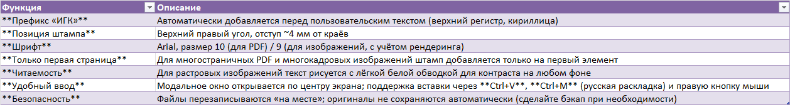

# 📌 Краткое описание

IGK Stamper — утилита для пакетной вставки текста с префиксом «ИГК» в файлы форматов PDF, JPEG, PNG, TIFF, GIF.
Программа добавляет штамп в верхний правый угол первой страницы/кадра, используя шрифт Arial, размер 10.
Поддерживает выбор нескольких файлов, центрированное модальное окно ввода и вставку текста через Ctrl+V или контекстное меню.

# 📋 Содержание

🔍 О проекте

🤝 Вклад в проект

# О проекте

## Назначение

Программа предназначена для автоматического добавления информационного штампа в документы и изображения. Это полезно для:

✅ Маркировки файлов служебной информацией

✅ Добавления водяных знаков или идентификаторов

✅ Пакетной обработки документов перед отправкой

## Как это работает

1. Запуск → открывается окно выбора файлов (поддерживается множественный выбор)

3. Выбор файлов → открывается модальное окно ввода текста (центрировано на экране)

4. Ввод текста → программа добавляет префикс "ИГК " и вставляет результат в файлы

5. Результат → файлы сохраняются с изменениями, показывается итоговое сообщение

## Особенности реализации

